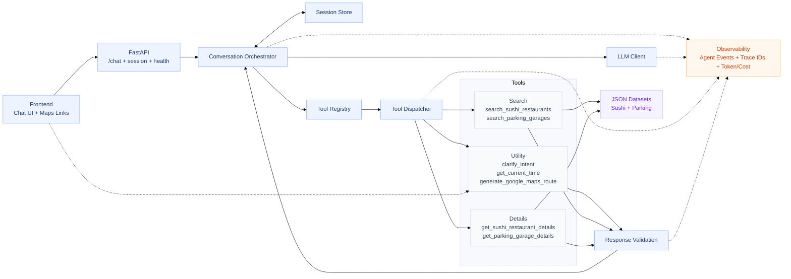

# Marienplatz POI Chatbot - Architectural Overview

This document outlines the system architecture of the Marienplatz POI Chatbot, detailing its modular design, LLM orchestration, and "Agentic Observability" framework. It also provides a roadmap for evolving this demo into a production-grade service.

## 1. System Architecture

The application follows a strictly layered architecture to ensure modularity, testability, and clear separation of concerns.

### 1.1 Architectural Overview

### 1.2 Layered Responsibility
1.  **Frontend (React/Vite)**: Handles user interaction, coordinates browser-side geolocation, and renders markdown (including clickable Google Maps links).
2.  **FastAPI Layer**: Thin entry point managing HTTP routing, session identification, and dependency injection.
3.  **Conversation Orchestrator**: The "brain" of the system. It manages the multi-step LLM loop, maintains session history, and resolves tool calls.
4.  **Tool & Domain Ecosystem**: A structured registry of functions exposed to the LLM. It enforces domain boundaries and validates all data before it enters the LLM context.
5.  **Observability Layer**: Captures "Agent Events" (LLM starts, tool ends, etc.) with unified Trace IDs for end-to-end debugging.

---

## 2. Tool Ecosystem

The LLM interacts with the physical world through a set of strictly typed tools.

| Tool Name | Type | Description |
| :--- | :--- | :--- |
| `search_sushi_restaurants` | Search | Finds sushi joints near Marienplatz with filters for rating, price, and distance. |
| `search_parking_garages` | Search | Finds parking with real-time occupancy, price-per-hour, and payment filters. |
| `get_sushi_restaurant_details` | Details | Retrieves full menu, reviews, and opening hours for a specific sushi restaurant. |
| `get_parking_garage_details` | Details | Provides detailed accessibility, security, and full opening hour info for a garage. |
| `generate_google_maps_route` | Utility | Generates an official Directions URL using user coords and tool-resolved destination points. |
| `get_current_time` | Utility | Provides the current Munich local time to enable time-based filtering (e.g., "what is open?"). |
| `clarify_intent` | Utility | Explicitly allows the LLM to ask for missing info instead of hallucinating when intent is ambiguous. |

---

## 3. LLM Orchestration Internals

### 3.1 System Prompt Engineering
The system uses a **Layered Prompt Architecture**:
1.  **Base Persona**: Defines the chatbot as a "knowledgeable and friendly Marienplatz guide."
2.  **Domain Guardrails**: Dynamically injected list of enabled domains (Sushi, Parking) to prevent out-of-scope assistance.
3.  **User Context**: Real-time injection of browser coordinates (or fallback defaults) and current local time.
4.  **Formatting Constraints**: Strict rules for list presentation, clickable links, and tone.

### 3.2 Context Window Management
*   **Pruning Strategy**: The `ConversationOrchestrator` implements a `_prune_history` logic that keeps only the last **6 messages**.
*   **Pair Preservation**: The pruner is "tool-aware" - it ensures that tool calls and their corresponding results are never separated by a prune, preventing LLM context errors.
*   **Reasoning Efficiency**: By keeping the window small, we ensure sub-2s processing times and minimize token costs.

### 3.3 Model Selection & Tuning
*   **Model**: `gpt-5-mini-2025-08-07`.
*   **Parameter Tuning**: `reasoning_effort="low"` and `max_tokens=8192`. This configuration optimizes for speed (crucial for mobile CX) while providing sufficient "thinking space" for complex multi-tool orchestration.

---

## 4. Production Evolution (Demo vs. Production)

| Feature | Demo/Test Implementation | Production-Grade Evolution             | Rationale |
| :--- | :--- |:---------------------------------------| :--- |
| **Session Store** | In-memory LRU Cache | Persistent Store (Redis/PostgreSQL)    | Enables cross-instance horizontal scaling and session persistence after server restarts. |
| **Data Source** | Local JSON Datasets | Managed Database (SQL/NoSQL)           | Supports massive data volumes, complex indexing, and real-time updates without redeployments. |
| **PII / Security** | Logic/Rounding in Orchestrator | Dedicated Sanitization Proxy & PII KMS | Moves sensitive data handling to an isolated, audited service. Protects against LLM prompt leaching. |
| **Observability** | Structured Console Logs | Distributed Tracing                    | Provides real-time alerting, trend analysis, and deep-dive debugging for non-deterministic LLM loops. |
| **Auth & Identity** | Session-based (Anonymous) | JWT Identity Provider                  | Required for personalized data, user-specific history, and higher-tier rate limiting/abuse prevention. |
| **Tool Execution** | Local function calls | Remote Tool Services (Serverless/API)  | decouples domain logic from the chatbot core, allowing domains to scale and fail independently. |

---

## 5. Security Principles

1.  **Strict Output Validation**: Pydantic models validate every tool response. Hallucinated data from tools is caught *before* it reaches the LLM.
2.  **Closed-Loop Function Calling**: `strict: true` schemas prevent the LLM from adding arbitrary parameters to tool calls.
3.  **Implicit Geolocation**: User coordinates are resolved server-side. the LLM never sees raw, high-precision GPS data unless required for a routing terminal point.
4.  **Modular Configuration**: All operational parameters and domain rules (required fields, payment methods) are centralized in `app/config.py`. The `.env` file is minimized to contain only secrets (API keys), ensuring a clean and predictable configuration across environments.
