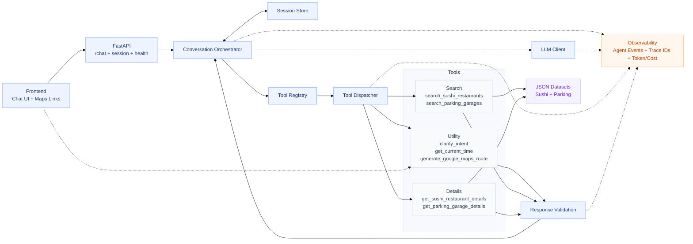

# Marienplatz POI Chatbot

Welcome to the Marienplatz POI Chatbot! This assistant is designed to help you navigate sushi restaurants and parking garages in the vibrant Marienplatz area of Munich.

## What the Bot Can Do
- **Search Sushi Restaurants**: Find places by name, rating, or price. Filter by accepted payment methods (cash, card, contactless).
- **Find Parking Garages**: Locate parking with real-time occupancy info, price per hour, and distance from your current location.
- **Get Details**: Retrieve full menus, opening hours, and specific amenities for any POI.
- **Route Generation**: Get direct Google Maps links from your current location to any destination.
- **Time-Awareness**: Ask "what is open right now?" and the bot will use current Munich time to filter results.
- **Graceful Clarification**: If your request is ambiguous, the bot will ask a short clarifying question instead of guessing.

## Project Structure

```text
.
├── app/
│   ├── config.py           # Centralized Pydantic settings & domain configs
│   ├── main.py             # FastAPI entry point & lifespan management
│   ├── core/
│   │   ├── orchestrator.py  # Multi-step LLM loop & session handling
│   │   ├── tool_dispatcher.py # Route tool calls to service handlers
│   │   └── tool_schemas.py  # Dynamic OpenAI function definitions
│   ├── repositories/       # Data access layer (JSON-based)
│   ├── services/           # Business logic (Geo, Sushi, Parking)
│   └── validation/         # Pydantic models & data integrity checks
├── tests/                  # 180+ tests covering security, logic, and API
├── data/                   # JSON datasets for sushi and parking
├── docker-compose.yml      # Deployment orchestration
└── pyproject.toml          # Dependency management (uv)
```

## System Architecture



## Installation & Setup

The easiest way to run the chatbot is using Docker (be sure, that you have inserted the GPT API key to the .env file before starting docker, if not, run the command one more time after inserting it):

```bash
docker compose up --build
```

The Chat UI will be available at `http://localhost:8000`.

**Please allow browser geolocation for proper functionality, otherwise, a default location will be used.**

## Configuration

All configuration is centralized in `app/config.py` and can be overridden via `.env` files. The system is designed to run with **minimal environment variables**—only the `OPENAI_API_KEY` is required in your `.env`.

| Variable | Description | Attribute in `Settings` |
| :--- | :--- | :--- |
| `OPENAI_API_KEY` | **Required**. Your OpenAI API Key. | `openai_api_key` |
| `OPENAI_MODEL` | The OpenAI model to use. | `openai_model` |
| `MAX_TOOL_ITERATIONS` | Prevent infinite LLM loops. | `max_tool_iterations` |
| `OPENAI_REASONING_EFFORT` | Model reasoning depth (gpt-5). | `openai_reasoning_effort` |
| `MAX_SESSIONS` | Max in-memory sessions (LRU). | `max_sessions` |
| `RATE_LIMIT_CHAT` | Global chat rate limit. | `rate_limit_chat` |

## Key Security & Observability
1. **PII Redaction**: User messages and high-precision coordinates are redacted or rounded in server logs.
2. **Strict Validation**: Every tool response is validated against a Pydantic model before reaching the LLM, preventing data corruption.
3. **Agentic Tracing**: Every request has a unique Trace ID, and significant events (LLM starts, tool calls, costs) are logged with performance metrics.
4. **Symbolic Cost Tracking**: The system calculates and logs token costs for every turn (set at $1.00/1M tokens for monitoring).

## Alternative Startup (Non-Docker)

If you don't have Docker installed, you can run the components manually:

### 1. Backend (FastAPI)
- **Prerequisites**: Python 3.12+ and [uv](https://github.com/astral-sh/uv) installed.
- **Setup**:
  ```bash
  uv sync
  ```
- **Run**:
  ```bash
  # Ensure OPENAI_API_KEY is in your .env or export it
  uv run uvicorn app.main:app --host 0.0.0.0 --port 8000 --reload
  ```

### 2. Frontend (React)
- **Prerequisites**: Node.js 18+ and npm installed.
- **Setup & Run**:
  ```bash
  cd frontend
  npm install
  npm run dev
  ```
- The UI will be available at `http://localhost:5173`.

